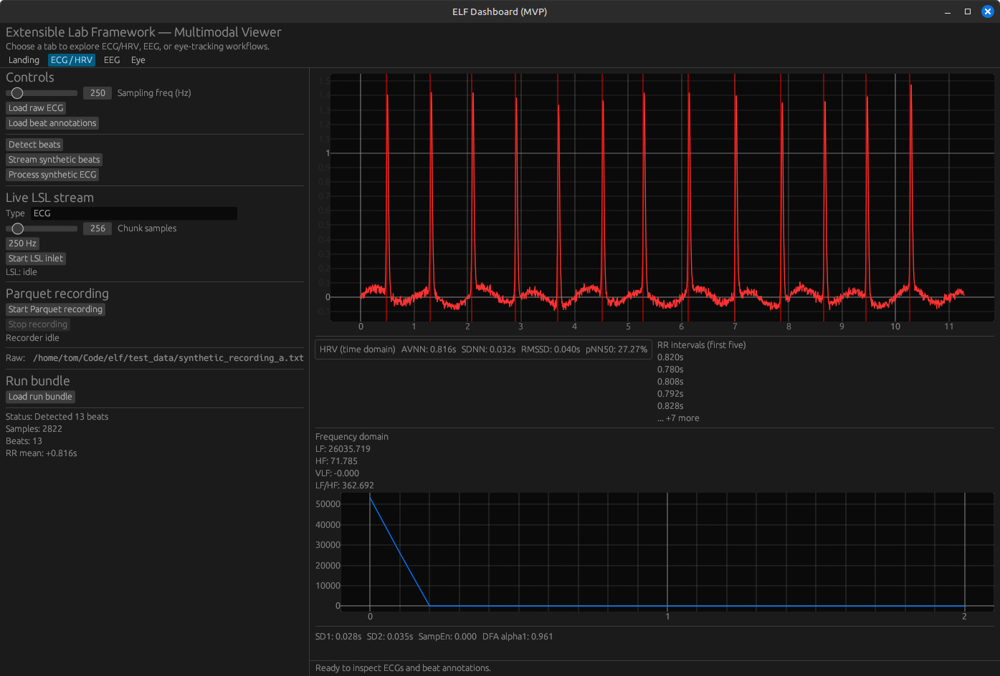

# ELF — Extensible Lab Framework

`elf` is a Rust-native, local-first toolkit for acquiring, processing, and visualizing physiological signals. It bundles a portable DSP core (`elf-lib`), a CLI entrypoint (`elf`), an egui dashboard (`elf-gui`), and supporting tools for EEG/eye tracking and streaming adapters. The focus is on transparent HRV analytics, extensible importers (WFDB, EDF, BITalino, OpenBCI, CSV, BIDS), and consistent plotting/validation across CLI + GUI targets.

---

## Getting started

### Build

```bash
cargo build --workspace
```

### CLI quick tour

Install the suite via `scripts/install.sh` (it unpacks a release tarball into `~/.local/opt/elf/<version>` and symlinks `elf`, `elf-gui`, and `elf-run` into `~/.local/bin`). Use `scripts/package.sh` (and `cargo build --release`) to produce the required tarball + SHA256; `install.sh` expects each release artifact to live at `https://example.com/elf/releases/<version>/elf-<version>-<arch>-<os>.tar.xz` with a matching `.sha256`. Once `elf` is on your PATH, run:

```bash
cat test_data/synthetic_recording_a.txt | elf -- ecg-find-rpeaks --fs 250 | jq
elf -- hrv-time --input test_data/tiny_rr.txt --fs 250 | jq
elf -- hrv-psd --input test_data/tiny_rr.txt --interp-fs 4 | jq
elf -- hrv-nonlinear --input test_data/tiny_rr.txt | jq
elf -- run-simulate --design test_data/run_design.toml --trials test_data/run_trials.csv --out /tmp/run
```

`run-simulate` schedules the STIMULUS_PRESENTER TOML/CSV trials, honors jitter/randomization, writes `events.tsv`/`events.json`, and ships a `run.json` manifest so the GUI can load the same bundle later.

### GUI quick tour

```bash
elf-gui
```

Load ECGs, annotations, and streaming data. The new `Load run bundle` button (HRV tab) points at a directory containing `events.tsv` + `run.json`, reflects manifest stats (ISI/jitter/policy), and feeds the shared `Store`. Legacy GUI controls for streaming, detection, and SQI remain available.

---

## Architecture overview

- `elf-lib`: signal I/O (CSV/WFDB/EDF/BITalino/OpenBCI/pupil), detectors, HRV/SQI metrics, and the shared `Figure/Series` plot model.
- `elf-cli`: the `elf` binary exposing `ecg-find-rpeaks`, `beat-hrv-pipeline`, `hrv-time`, `hrv-psd`, `hrv-nonlinear`, `sqi`, `dataset-validate`, and `run-simulate`; core crates reused by CLI + GUI.
- `elf-gui`: `eframe` dashboard running the `StreamingStateRouter`, `Store`, and run-bundle loader so CLI and GUI share state.

---

## Validation & testing

- `cargo test` covers the CLI regression suite (including the new run-simulate tests), PSD/nonlinear metrics, and SQI helpers.
- CI runs `cargo fmt`, `cargo clippy`, `cargo build`, `cargo test`, and `elf -- dataset-validate --spec test_data/dataset_suite_core.json`.
- Extend `test_data/` with new fixtures (RR, WFDB, BIDS, BITalino, run specs) and add them to the dataset suite to lock regressions.

---

## Installer helpers

`install.sh` (scripts/install.sh) downloads a release tarball from `BASE_URL` (default `https://example.com/elf/releases/<version>/elf-<version>-<arch>-<os>.tar.xz`), verifies the SHA256, extracts into `~/.local/opt/elf/<version>`, and symlinks `elf`, `elf-gui`, `elf-run`. Run `scripts/uninstall.sh` to remove the symlinks and `current` pointer.

---

## Contributing

Follow `AGENTS.md`: use `bd` for issues, keep planning docs under `history/`, and keep the `test_data/` regression fixtures in sync with your changes.
